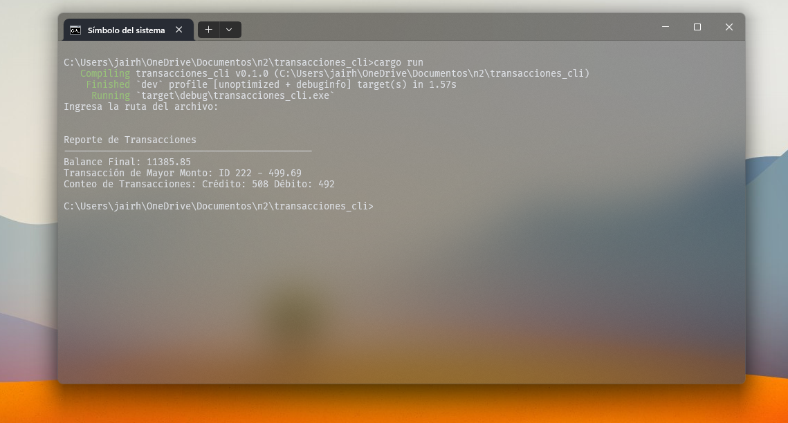

# Procesador de Transacciones Bancarias (CLI en Rust)

Este proyecto es una aplicación de línea de comandos (CLI) desarrollada en Rust que procesa un archivo CSV con transacciones bancarias. El objetivo es leer el archivo, analizar los datos y generar un reporte con información clave como balance final, transacción más grande y cantidad de transacciones por tipo.



---

## 🚀 Instrucciones de Ejecución

### Requisitos

- Tener instalado [Rust](https://www.rust-lang.org/es/tools/install)

### Cómo utilizar
1. Compila y ejecuta el proyecto con:

```bash
cargo run
```

2. El programa te pedirá que escribas la ruta del archivo CSV:

- Si escribes una ruta, usará ese archivo.

- Si presionas Enter sin escribir nada, el programa usará la ruta predeterminada ./data/data.csv, donde ya se encuentra el archivo de prueba incluido en el proyecto.


## Enfoque y Solución

El programa fue diseñado con un enfoque **simple**.

Se optó por leer el archivo con `BufReader` línea por línea. Esto permite un **uso eficiente de la RAM**, especialmente útil si se trabaja con archivos grandes.

La lógica general sigue estos pasos:

1. **Apertura del archivo CSV** usando `File::open` y `BufReader`.
2. **Lectura línea por línea**, ignorando la cabecera.
3. **Procesamiento de cada transacción**, separando por tipo con `match`:
   - Si es `"Crédito"`, se suma al balance.
   - Si es `"Débito"`, se resta del balance.
4. **Conteo de transacciones** por tipo.
5. **Identificación de la transacción con mayor monto**.
6. **Impresión del reporte final** en la terminal.

Además, se manejan errores básicos como:

- Archivo no encontrado o ruta inválida.
- Líneas con formato incorrecto o datos no numéricos.

## Estructura del Proyecto

```
transacciones_cli/
├── Cargo.toml        # Archivo de configuración de Rust
├── data/
│   └── data.csv      # Archivo de prueba con transacciones
└── src/
    └── main.rs       # Archivo principal del proyecto

```